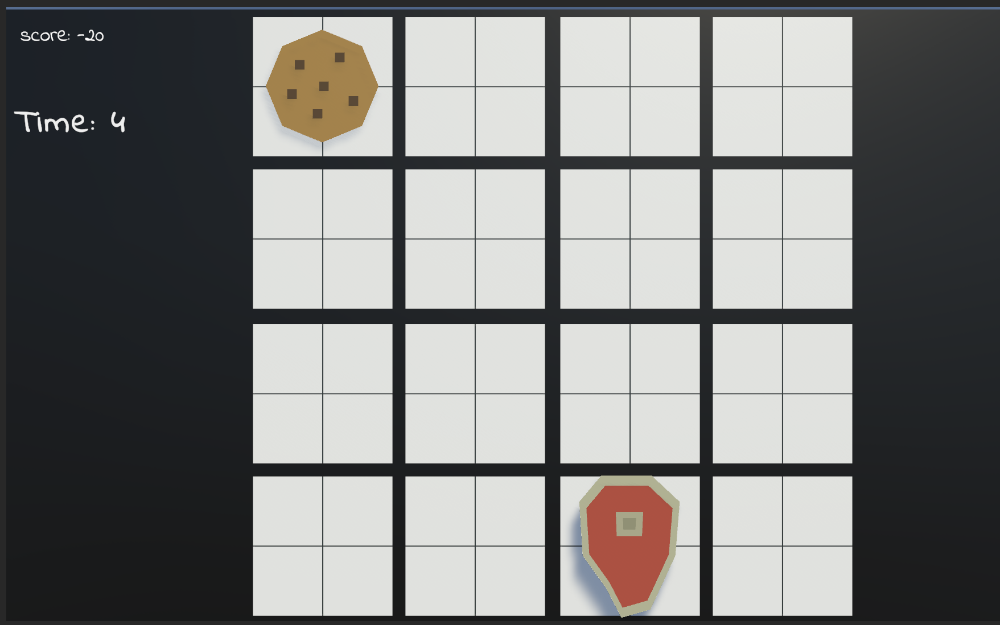

## Whack a Food

### Game Concept
- A game experience based on the player's quick reflexes and attention, similar to "Whack a Mole."
- The player must click on the appearing foods within a specific time frame while avoiding skulls.

### Game Mechanics

### Difficulty Levels
- Three difficulty levels will be presented to the user at the beginning: "Easy," "Medium," and "Hard."
- Difficulty levels will affect the intervals and speed of object appearances on the screen.

### Object Appearance Mechanism
- Foods and skulls will appear randomly at specified intervals.
- The speed of appearance will increase based on the selected difficulty level.

### Scoring and Losing
- Clicking on foods correctly will earn points.
- Clicking on skulls will deduct points.
- Failing to click on a certain number of objects(3 objects) within the set time will result in losing the game.

### Game Duration
- A timer will start when the game begins, and the game will continue for a specified duration, e.g., 35 seconds.

### Objects

### Food Types
- Foods like cookies, pizza, and steak.
- Each food type will have a different point value.

### Skull
- Skulls should not be clicked, and clicking on them should result in point deduction.

### Screenshot

